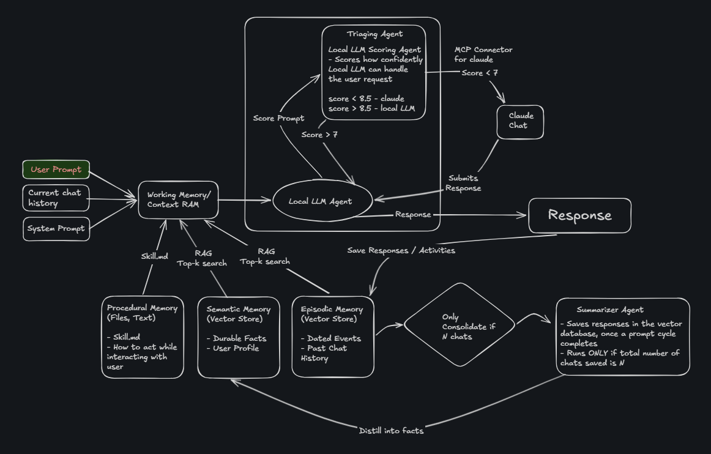

# Mach1 — Local-First AI Agent

> *"Sometimes you gotta run before you can walk."* — Tony Stark

Mach1 is a personal AI agent built for speed, privacy, and intelligence. It runs locally on open-source LLMs, escalates to Claude only when it genuinely needs to, and remembers everything across sessions. Built phase by phase — from a basic chatbot to a full LangGraph multi-tool agent.

---

## Agent Loop



**RAG injection** happens inside the local node — before inference, the agent pulls relevant episodic memories and semantic facts into the system prompt via Top-k similarity search.

**Tool loop** runs inside the local node — the LLM keeps calling tools until no more tool_calls remain, then returns.

---

## Build Phases

| # | Phase | What it adds | Status |
|---|-------|-------------|--------|
| 1 | Simple LangChain Agent | Basic chat with Ollama — `ChatOllama` + message loop | ✅ |
| 2 | Persona Agent | System prompt, persona, FastAPI server | ✅ |
| 3 | Tool-Using Agent | File tools, `create_react_agent`, LangGraph basics | ✅ |
| 4 | Confidence Scoring | 1–10 self-rating before answering | ✅ |
| 5 | Triage Routing | Local vs Claude routing based on score + threshold | ✅ |
| 6 | Episodic Memory | ChromaDB vector store, RAG recall, `nomic-embed-text` | ✅ |
| 7 | Semantic Memory | Fact extraction, semantic store, Summarizer Agent | ✅ |
| 8 | LangGraph Tools Agent | Full `StateGraph`, web search, file ops, Python REPL, shell, Wikipedia, Stack Overflow, URL browsing, session isolation, React UI | ✅ |

---

## Tech Stack

| Layer | Tech |
|---|---|
| Agent framework | LangChain + LangGraph `StateGraph` |
| Local LLM | Ollama — `gemma4:latest` |
| Cloud fallback | Claude via `claude` CLI (MCP) |
| Embeddings | `nomic-embed-text` via Ollama |
| Vector DB | ChromaDB (embedded, no server) |
| API server | FastAPI + Uvicorn |
| UI | React + TypeScript + Vite |
| Styling | Vanilla CSS (GitHub-dark theme) |

---

## Tools Available in Phase 8

| Category | Tools |
|---|---|
| File ops | `create_file`, `read_file`, `edit_file`, `edit_section`, `append_to_file`, `delete_file` |
| System | `ShellTool`, `ListDirectoryTool`, `FileSearchTool` |
| Code | `python_repl` (PythonREPL) |
| Web | `DuckDuckGoSearchRun`, `WikipediaQueryRun`, `browse_url`, `search_stackoverflow` |

---

## Memory System

| Layer | Store | What it holds | How it's used |
|---|---|---|---|
| Working Memory | In-process list | Current session's conversation | Passed directly to LLM |
| Episodic Memory | ChromaDB | Past messages (user + assistant) | RAG Top-k before each response |
| Semantic Memory | ChromaDB | Extracted long-term facts | RAG Top-k before each response |

Every 10 turns, the **Summarizer Agent** reads recent episodic entries and distills them into clean facts written back to Semantic Memory — keeping the store sharp over time.

---

## Triage Routing

```
Score ≥ 7  →  Local LLM  (fast, free, private)
Score < 7  →  Claude     (powerful, costs tokens)
```

- Threshold is live-adjustable from the UI via `PATCH /config`
- Every response shows which path was taken (`handled_by`)
- `force_model: "local" | "claude"` overrides routing per request

---

## Session Isolation

Each chat window is a fully independent session:

- `POST /session` creates a UUID-keyed session in `sessions: dict`
- `backendId` is lazily assigned on the first message (no orphan sessions)
- Histories never bleed across sessions — backend restart auto-vivifies
- `DELETE /session/{id}` cleans up on permanent delete

---

## Running Locally

```bash
# 1. Pull models
ollama pull gemma4:latest
ollama pull nomic-embed-text
ollama serve

# 2. Start the agent server
cd p8-LangGraph-Tools-Agent
pip install -r requirements.txt
python server.py
# → http://localhost:8000

# 3. Start the UI
cd ../agent-ui
npm install
npm run dev
# → http://localhost:5173
```

Requires: `claude` CLI installed and authenticated (for cloud fallback).

---

## UI Features

- Multi-session sidebar with pin, archive, rename, permanent delete
- System prompt selector (disappears after first message)
- Tools badge on assistant messages — hover to see which tools fired
- Live confidence score + `handled_by` tag on each response
- Memory indicator when past context was used
- Settings panel with live threshold slider
- Keyboard shortcuts: `Ctrl+N` new session, `Ctrl+/` settings

---


*Built by Priyansh · [priyansh.9071@gmail.com](mailto:priyansh.9071@gmail.com)*
